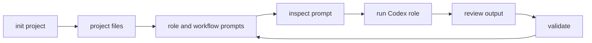

# Codex Game Studio

**Turn a Codex session into a structured, local-first game studio.**

Codex Game Studio is a TypeScript CLI that creates game-project workspaces with Codex-ready roles, prompts, workflow templates, and validation. It keeps the studio state in Git-reviewable files instead of hiding planning, prompts, and run context in a hosted service.

[](LICENSE)
[](package.json)
[](tsconfig.json)

```sh
./codex-game-studio init --name "Signal Cartographer" --engine godot --mode prototype --non-interactive \
  --concept "A compact puzzle game about routing trains through haunted switchyards"

./codex-game-studio run producer --project projects/signal-cartographer \
  "Create the initial market overview."

./codex-game-studio validate --project projects/signal-cartographer
```

## Why this exists

Working with one general-purpose AI coding session is powerful, but game development needs more structure than a blank chat box:

- Producers need milestones, handoffs, and release checks.
- Designers need GDDs, systems specs, player journeys, and tuning loops.
- Engineers need bounded implementation prompts and validation gates.
- Artists, QA, audio, localization, and live-ops work need their own context.
- Reviewers need ordinary files they can inspect in Git.

Codex Game Studio gives Codex a studio-shaped workspace: role prompts, workflow prompts, engine context, templates, file-backed task state, and hard-failing validation. You still make the creative decisions; the CLI gives each Codex task a clear contract.

## What you get

| Capability | What it does |
| --- | --- |
| Local project scaffolding | Creates deterministic game projects under `projects/<slug>/`. |
| Codex-native role prompts | Generates `.codex/prompts/<role>.md` and a project `AGENTS.md`. |
| Workflow prompts | Generates reusable production, design, QA, release, and review workflows. |
| Engine overlays | Adds Godot, Unity, or Unreal context and source layout markers. |
| Focused context packets | Gives each role the templates and project files it needs, not the whole repo. |
| Direct Codex execution | Runs `codex exec` for `run <role>` by default. |
| Inspection modes | Supports `--dry-run` and `--print-prompt` before Codex touches the workspace. |
| File-backed tasks | Stores explicit tasks, locks, and run metadata under `.codex/**`. |
| Validation | Fails on stale generated prompts, malformed metadata, missing assets, invalid project state, and future-only CLI drift. |
| Git-reviewable state | Keeps project contracts, prompts, workflows, and docs in normal files. |

## Quick start from a source checkout

Requirements:

- Node.js 24 or newer.
- Codex CLI on `PATH` for `run <role>` and full validation.

```sh
git clone git@github.com:merlinhu1/codex-game-studio.git
cd codex-game-studio
npm install
npm run build

./codex-game-studio --help
```

Create and validate a project:

```sh
./codex-game-studio init --name "My Game" --engine godot --mode prototype --non-interactive \
  --concept "A compact puzzle game about routing trains"

./codex-game-studio status --project projects/my-game
./codex-game-studio validate --project projects/my-game
```

This repository does **not** commit generated bundled CLI artifacts. The checked-in wrapper runs the built TypeScript entrypoint at `dist/cli.js`; if that file is missing, run `npm install && npm run build`.

## The studio loop



A generated project contains the contract Codex needs: project summary, engine context, role prompts, workflow prompts, starter production docs, and validation metadata. Role runs prepare bounded prompt packets under `.codex/runs/` and invoke `codex exec` from the project root.

## Daily workflow

### 1. Create or inspect project state

```sh
./codex-game-studio init --name "My Game" --engine godot --mode prototype --non-interactive
./codex-game-studio status --project projects/my-game
./codex-game-studio resume --project projects/my-game
```

`status` and `resume` are read-only. `freeze` is the explicit command that changes project status.

### 2. Use templates and workflow prompts

```sh
./codex-game-studio templates list
./codex-game-studio templates show gdd
./codex-game-studio market --project projects/my-game
./codex-game-studio ship-check --project projects/my-game
```

Workflow shortcuts render focused prompts. They do not launch Codex unless you explicitly use `run <role>` or a task execution command.

### 3. Run a studio role

```sh
./codex-game-studio run producer --project projects/my-game \
  "Create the initial market overview."
```

Inspect first when the task is risky or broad:

```sh
./codex-game-studio run producer --project projects/my-game \
  "Create the initial market overview." --dry-run

./codex-game-studio run producer --project projects/my-game \
  "Create the initial market overview." --print-prompt
```

`run <role>` loads the generated project role prompt and selected templates for that role/task. `--allow-broad-context` adds bounded discovery for existing artifacts such as the GDD, production timeline, market overview, `AGENTS.md`, and `.codex/studio.json`; it does not recursively dump the project into the prompt.

### 4. Validate before trusting output

```sh
./codex-game-studio validate
./codex-game-studio validate --project projects/my-game
```

Repository validation checks package contracts, build output, packaged assets, template availability, hidden future-only surfaces, role/workflow rendering, and Codex CLI readiness. Project validation checks project state, generated prompt/workflow freshness, rendered-body hashes, metadata integrity, starter docs, read-only command behavior, and forbidden legacy artifacts.

## Commands

| Command | What it does |
| --- | --- |
| `init` / `new` | Create a project under `projects/<slug>/`. |
| `status` | Print project phase, status, engine, and the next validation command. |
| `resume` | Print a read-only continuation summary. |
| `refresh-context` | Regenerate `.codex/context-manifest.json` after selected context files change. |
| `freeze` | Mark a project as frozen. |
| `validate` | Run hard-failing repository or project validation. |
| `templates list` | List packaged template IDs. |
| `templates show <template-id>` | Print a packaged template. |
| `run <role>` | Prepare one bounded Codex prompt packet and invoke `codex exec`. |
| `task create` / `task run` / `task orchestrate` | Manage file-backed `.codex/tasks.json` work and bounded local orchestration. |
| `workflow create-tasks <workflow-id>` | Create explicit tasks from recipes such as `vertical-slice`, `bugfix`, `ui-ux-review`, and `release-checklist`. |
| `market`, `analytics`, `design-spec`, `feel-review`, `art-direction`, `ui-review`, `milestone`, `handoff`, `review`, `ship-check` | Render focused workflow prompts. |

## Studio roles

| Area | Roles |
| --- | --- |
| Direction and production | `studio-orchestrator`, `producer`, `release-manager` |
| Market and analytics | `market-analyst`, `data-scientist` |
| Design and writing | `creative-director`, `senior-game-designer`, `game-designer`, `narrative-designer`, `writer`, `world-builder`, `level-designer`, `game-feel-designer`, `systems-designer`, `economy-designer` |
| Engineering | `gameplay-programmer`, `ai-programmer`, `network-programmer`, `ui-programmer`, `engine-programmer`, `tools-programmer`, `technical-director`, `devops-engineer`, `security-engineer`, `performance-analyst` |
| Engine specialists | `godot-specialist`, `unity-specialist`, `unreal-specialist` |
| Art, audio, UX | `senior-game-artist`, `technical-artist`, `audio-director`, `sound-designer`, `ui-ux-designer`, `accessibility-specialist` |
| QA, localization, operations | `qa-playtester`, `localization-lead`, `live-ops-designer`, `community-manager` |

Role IDs are Codex-native and hyphenated. Unsupported legacy underscore IDs are rejected instead of silently mapped.

## What gets generated

Repository assets:

- `src/`: TypeScript CLI implementation.
- `src/roles.ts`: role-package registry compiled into the CLI.
- `templates/`: design, production, art, QA, release, analytics, and engine templates.
- `engine_configs/`: engine overlays for Godot, Unity, and Unreal.
- `engine_reference/`: curated engine reference packs selected by role and task.
- `docs/`: setup, migration, validation, architecture, and truth docs.
- `tests/`: Vitest coverage for projects, prompts, templates, validation, runner behavior, engine behavior, and orchestration.

Generated project assets:

- `projects/<slug>/`: generated project root.
- `AGENTS.md`: generated Codex project instructions, owned by `src/agents.ts`.
- `.codex/studio.json`: project metadata, role roster, workflow IDs, and workflow state.
- `.codex/prompts/`: generated role prompts.
- `.codex/workflows/`: generated workflow prompts.
- `.codex/runs/`: prompt packets and run metadata.
- `.codex/tasks.json`: file-backed task state.
- `.codex/locks/`: transient locks for bounded local orchestration.
- `documentation/`: starter game-design and production documents.
- `source/project-<slug>/`: engine project location contract.

Generated role prompts and workflow files carry deterministic freshness metadata and rendered-body hashes. Validation compares those files against the current renderer and flags stale, malformed, or manually tampered surfaces.

## Design boundaries

Codex Game Studio is a local workflow layer, not a game engine and not an autonomous studio manager.

Implemented now:

- deterministic project scaffolding;
- generated Codex role and workflow surfaces;
- direct `codex exec` role execution;
- dry-run and prompt-print inspection;
- file-backed tasks and bounded local orchestration;
- workflow task recipes for selected high-value workflows;
- curated CCGS adaptation decisions;
- hard-failing repository and project validation.

Not exposed as working features:

- planner or `next` command;
- telemetry;
- changed-file tracking;
- hosted/background orchestration;
- unbounded parallelism;
- hard output-ownership enforcement;
- generated `CODEX.md` or `project_orchestrator.md` surfaces.

See [`docs/known-upstream-differences.md`](docs/known-upstream-differences.md) and [`docs/migration-from-claude.md`](docs/migration-from-claude.md) for migration details.

## Package use

After publishing, installing, or linking the package:

```sh
npm exec codex-game-studio -- --help
npm exec codex-game-studio -- templates list
```

The package bin is `codex-game-studio` and points to the built `dist/cli.js` entrypoint.

## Development

```sh
npm install
npm run build
npm run typecheck
npm test
npm run validate
```

This project uses ESM TypeScript with `module` and `moduleResolution` set to `NodeNext`. Relative TypeScript imports include emitted `.js` specifiers.

Before opening changes, run the checks in [`CONTRIBUTING.md`](CONTRIBUTING.md). Functional behavior changes should keep README claims, validation behavior, tests, and Truthmark-backed docs in sync.

## Documentation

- [Setup](docs/setup.md)
- [Examples](docs/examples.md)
- [Workflow validation](docs/workflow-validation.md)
- [Known upstream differences](docs/known-upstream-differences.md)
- [Migration from Claude-oriented game studio workflows](docs/migration-from-claude.md)
- [Architecture overview](docs/architecture/product-boundary.md)

## License

Codex Game Studio is released under the MIT License. See [`LICENSE`](LICENSE).
