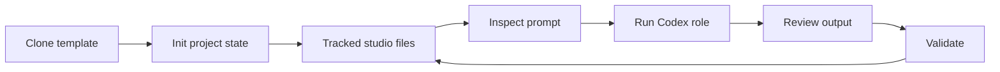

# Codex Game Studio

**Turn a Codex session into a structured, local-first game studio.**

[🇺🇸 English](README.md) | [🇨🇳 简体中文](docs/readmes/README.zh.md) | [🇯🇵 日本語](docs/readmes/README.ja.md) | [🇰🇷 한국어](docs/readmes/README.ko.md)

[](LICENSE)
[](package.json)
[](tsconfig.json)

Codex Game Studio is a TypeScript CLI for running game-development work through Codex with a studio-shaped workspace: roles, workflow prompts, project files, task state, and validation live in ordinary Git-reviewable files.

It is not a game engine and not a hosted project manager. It gives Codex a clearer contract for production, design, engineering, QA, art, audio, localization, and release work while leaving creative decisions and review with you.

## Quick start

Requirements: Node.js 24 or newer. The Codex CLI is required for `run <role>`.

```sh
git clone git@github.com:merlinhu1/codex-game-studio.git signal-cartographer
cd signal-cartographer
npm install
npm run build

./codex-game-studio init --name "Signal Cartographer" --engine godot --mode prototype --non-interactive \
  --concept "A compact puzzle game about routing trains through haunted switchyards"

./codex-game-studio status
./codex-game-studio validate
```

To inspect a role prompt before launching Codex:

```sh
./codex-game-studio run producer \
  "Create the initial market overview." --print-prompt
```

For command-by-command usage, see the [User Guide](docs/user-guide.md).

## Why this exists

A blank AI coding chat is flexible, but game development needs repeatable studio structure:

- Producers need milestones, handoffs, and release checks.
- Designers need GDDs, systems specs, player journeys, and tuning loops.
- Engineers need bounded implementation prompts and validation gates.
- Artists, QA, audio, localization, and live-ops work need their own context.
- Reviewers need files they can inspect in Git, not decisions trapped in chat history.

Codex Game Studio keeps that structure in clone-visible template files that Codex can read and humans can review.

## What you get

| Capability | What it means |
| --- | --- |
| Template repository surfaces | Tracks game-facing `AGENTS.md`, `.codex/agents/*.toml`, `.codex/workflows/*.md`, and `.agents/skills/*/SKILL.md` directly in Git. |
| Codex-native studio roles | Provides focused role contracts for production, design, engineering, art, QA, localization, and release work. |
| Workflow prompts | Provides tracked reusable workflows for market review, analytics, specs, handoffs, ship checks, UI review, and more. |
| Engine overlays | Adds Godot, Unity, or Unreal context without turning this project into an engine wrapper. |
| File-backed task state | Stores explicit tasks, locks, and run metadata under `.codex/**`. |
| Inspection before execution | Supports dry-run and prompt-print paths before Codex touches a project. |
| Hard-failing validation | Detects missing template surfaces, malformed project state, missing assets, and future-only CLI drift. |

## The studio loop



The cloned template is the contract. It contains game-facing instructions, agents, workflows, and skills; `init` records project state, starter docs, engine references, and runtime metadata without rewriting those template surfaces.

## Where details live

| Need | Start here |
| --- | --- |
| Install, commands, workflows, validation | [User Guide](docs/user-guide.md) |
| Role catalog and when to use each role | [Studio Roles](docs/studio-roles.md) |
| Template tree and file ownership | [Project Anatomy](docs/project-anatomy.md) |
| Realistic usage scenarios | [Examples](docs/examples/README.md) |
| Contributor workflow and checks | [Development](docs/development.md) |
| Full documentation map | [Docs Index](docs/README.md) |
| Product boundaries and non-goals | [Product Boundary](docs/architecture/product-boundary.md) |
| Differences from Claude Code Game Studios | [Migration from Claude](docs/migration-from-claude.md) |

## Project status

Codex Game Studio currently supports deterministic project scaffolding, Codex role execution, workflow prompt rendering, file-backed task orchestration, and repository/project validation.

The project deliberately does not expose a planner or `next` command, telemetry, hosted orchestration, unbounded parallelism, hard output-ownership enforcement, or generated `CODEX.md` / `project_orchestrator.md` surfaces. See [Known Upstream Differences](docs/known-upstream-differences.md) for migration details.

## License

Codex Game Studio is released under the MIT License. See [`LICENSE`](LICENSE).

## Codex prompt model routing

Prompt surfaces declare exact Codex model policy in tracked template files. Complex design, architecture, production, and release-gate surfaces use `gpt-5.5`; moderate implementation, QA, docs, bugfix, and bounded workflow surfaces use `gpt-5.4`; simple help, status, classification, checklist, and lookup surfaces use `gpt-5.4-mini`. Runtime dry-runs and run metadata expose the selected model and reasoning effort, and Codex execution receives the exact selected model instead of a generic tier name.
