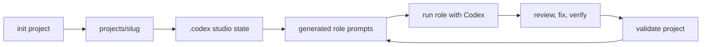

# Open Game Studio

[](LICENSE)
[](package.json)
[](tsconfig.json)

Open Game Studio is a Codex-native command line studio for making games with AI agents without hiding the workflow in a black box.

Create a local game project, generate Codex-ready role prompts, hand focused work to a studio role, then validate the project artifacts before you trust them. The state lives in your repository under `.codex/`; generated games live under `projects/<slug>/`; normal execution goes through `codex exec`.

```sh
npm run init -- --name "Signal Cartographer" --engine godot --mode prototype --non-interactive \
  --concept "A compact puzzle game about routing trains through haunted switchyards"

node dist/cli.js run producer --project projects/signal-cartographer \
  "Create the initial market overview."

npm run validate -- --project projects/signal-cartographer
```

## Why developers use it

Open Game Studio gives game teams a repeatable way to work with Codex across design, production, engineering, art, QA, and release tasks.

- Local-first project state. No hosted planner, hidden queue, or opaque database.
- Codex-native instructions in generated `AGENTS.md` and `.codex/prompts/<role>.md` files.
- Role-specific context packets instead of dumping every template into every task.
- Hard-failing validation for generated prompts, workflows, package assets, and project contracts.
- Inspection paths with `--dry-run` and `--print-prompt` before Codex touches the workspace.
- Engine scaffolding for Godot, Unity, and Unreal projects.

This is not a game engine and it is not a replacement for human creative direction. It is a workflow layer: a small, inspectable CLI that turns studio roles and production documents into bounded Codex work.

## The studio loop



A generated project contains the working contract Codex needs: project summary, engine context, role prompts, workflow prompts, starter production docs, and validation metadata. Role runs prepare a bounded prompt packet under `.codex/runs/` and invoke `codex exec` from the project root.

## Requirements

- Node.js 24 or newer.
- npm.
- Codex CLI available on `PATH` for normal `run <role>` execution and full validation.

## Install from source

```sh
git clone git@github.com:merlinhu1/open-gamestudio.git
cd open-gamestudio
npm install
npm run build
node dist/cli.js --help
```

For package use after installing or linking the package:

```sh
npm exec opengamestudio -- --help
npm exec opengamestudio -- templates list
```

For local development from this checkout, prefer the npm scripts. They build first and exercise the built CLI through `node dist/cli.js`:

```sh
npm run init -- --name "My Game" --engine godot --mode prototype --non-interactive
npm run manage -- --project projects/my-game
npm run templates -- list
npm run validate -- --project projects/my-game
```

## Quick start

### 1. Create a project

```sh
npm run init -- --name "My Game" --engine godot --mode prototype --non-interactive \
  --concept "A compact puzzle game about routing trains"
```

Open Game Studio creates `projects/my-game/` with engine markers, starter docs, `.codex/studio.json`, generated role prompts, generated workflow prompts, and a project-level `AGENTS.md`.

### 2. Inspect the project

```sh
npm run manage -- --project projects/my-game
node dist/cli.js resume --project projects/my-game
```

`status` and `resume` are read-only. `freeze` is the explicit command that changes project status.

### 3. Choose a template or workflow

```sh
npm run templates -- list
npm run templates -- show gdd
node dist/cli.js market --project projects/my-game
node dist/cli.js ship-check --project projects/my-game
```

Workflow shortcuts render prompts only. They do not launch Codex.

### 4. Run a studio role through Codex

```sh
npm run build --silent
node dist/cli.js run producer --project projects/my-game \
  "Create the initial market overview."
```

Want to see exactly what Codex will receive first?

```sh
node dist/cli.js run producer --project projects/my-game \
  "Create the initial market overview." --dry-run

node dist/cli.js run producer --project projects/my-game \
  "Create the initial market overview." --print-prompt
```

`run <role>` inlines the generated project role prompt from `.codex/prompts/<role>.md` and only the package templates selected for that role and task. `--allow-broad-context` adds bounded discovery for existing project artifacts such as the GDD, production timeline, market overview, `AGENTS.md`, and `.codex/studio.json`; it does not recursively load the whole project.

### 5. Validate before relying on output

```sh
npm run validate
npm run validate -- --project projects/my-game
```

Validation exits nonzero on failure. It checks package contracts, template availability, forbidden future surfaces, build output, project state, generated-surface freshness metadata, rendered-body hashes, and stale or tampered generated prompt/workflow files.

## Commands

| Command | What it does |
| --- | --- |
| `init` / `new` | Create a project under `projects/<slug>/`. |
| `status` | Print project phase, status, engine, and the next validation command. |
| `resume` | Print a read-only continuation summary. |
| `freeze` | Mark a project as frozen. |
| `validate` | Run hard-failing repository or project validation. |
| `templates list` | List packaged template IDs. |
| `templates show <template-id>` | Print a packaged template. |
| `run <role>` | Prepare one bounded Codex prompt packet and invoke `codex exec` by default. |
| `task create` / `task run` / `task orchestrate` | Manage file-backed `.codex/tasks.json` tasks and run explicit local bounded orchestration. |
| `market`, `analytics`, `design-spec`, `feel-review`, `art-direction`, `ui-review`, `milestone`, `handoff` | Render focused workflow prompts. |
| `review`, `ship-check` | Render baseline review and release-check prompts. |
| `workflow create-tasks <workflow-id>` | Create explicit file-backed tasks from supported workflow recipes such as `vertical-slice`, `bugfix`, `ui-ux-review`, and `release-checklist`. |

## Studio roles

Open Game Studio ships a Codex-native role roster with hyphenated IDs:

| Area | Roles |
| --- | --- |
| Direction and production | `studio-orchestrator`, `producer`, `release-manager` |
| Market and analytics | `market-analyst`, `data-scientist` |
| Design and writing | `creative-director`, `senior-game-designer`, `game-designer`, `narrative-designer`, `game-feel-designer` |
| Engineering | `gameplay-programmer`, `engine-programmer`, `tools-programmer` |
| Art and interface | `senior-game-artist`, `technical-artist`, `ui-ux-designer` |
| Quality | `qa-playtester` |

Legacy underscore role IDs are intentionally rejected. `narrative-designer` is a first-class story and content owner.

## What gets generated

Repository assets:

- `src/`: TypeScript CLI implementation.
- `src/roles.ts`: Codex role packages compiled into the CLI.
- `templates/`: reusable design, production, art, QA, release, analytics, and engine templates.
- `engine_configs/`: engine overlays for Godot, Unity, and Unreal.
- `docs/`: migration, validation, truth, and compatibility notes.
- `tests/`: Vitest coverage for project workflow, templates, agents, runner prompts, validation, and engine behavior.

Project artifacts:

- `projects/<slug>/`: generated project root.
- `AGENTS.md`: primary generated Codex project instructions, owned by `src/agents.ts`.
- `.codex/studio.json`: project metadata, role roster, workflow IDs, and workflow state.
- `.codex/prompts/`: generated role prompts.
- `.codex/workflows/`: generated workflow prompts.
- `.codex/runs/`: prepared prompt packets, per-task orchestration output, and run metadata from non-dry role or orchestration runs.
- `.codex/locks/`: transient file-backed locks for bounded parallel task orchestration.
- `.codex/tasks.json`: file-backed task state when you use `task create`, `task run`, workflow task recipes, or `task orchestrate`.
- `documentation/`: starter game-design and production documents.
- `source/project-<slug>/`: engine project location contract.

Generated role prompts and workflow files carry deterministic freshness metadata and rendered-body hashes. New project validation compares those files against the current renderer and flags stale, malformed, or manually tampered surfaces.

## Current boundaries

Open Game Studio is intentionally narrow right now.

Implemented:

- deterministic project scaffolding;
- generated Codex role and workflow surfaces;
- direct `codex exec` role execution;
- dry-run and prompt-print inspection;
- file-backed tasks;
- explicit local task orchestration with bounded `--max-concurrency` and file-backed locks;
- workflow task recipes for selected high-value workflows;
- curated CCGS adaptation registry for role/skill/workflow translation decisions;
- bounded review, verification, and fix-pass options;
- hard-failing repository and project validation.

Future-only, not exposed as working features:

- planner/`next`;
- telemetry;
- changed-file tracking;
- hosted/background orchestration;
- unbounded parallelism;
- hard output-ownership enforcement;
- legacy `.gamestudio` compatibility;
- generated `CODEX.md` or `project_orchestrator.md` surfaces.

Explicit local task orchestration is now inside the product boundary, but user-facing runtime claims require implementation, tests, and docs.

See [`docs/known-upstream-differences.md`](docs/known-upstream-differences.md) and [`docs/migration-from-claude.md`](docs/migration-from-claude.md) for the detailed migration contract.

## Development

```sh
npm run build
npm run typecheck
npm run test
npm run validate
```

The project uses ESM TypeScript with `module` and `moduleResolution` set to `NodeNext`. Relative TypeScript imports include the emitted `.js` specifier.

Before opening changes, run the checks in [`CONTRIBUTING.md`](CONTRIBUTING.md). Functional behavior changes should keep README claims, validation behavior, tests, and Truthmark-backed docs in sync.

## License

Open Game Studio is released under the MIT License. See [`LICENSE`](LICENSE).
