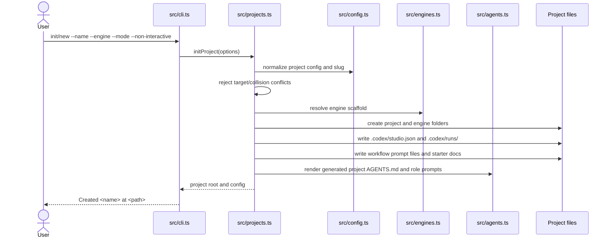
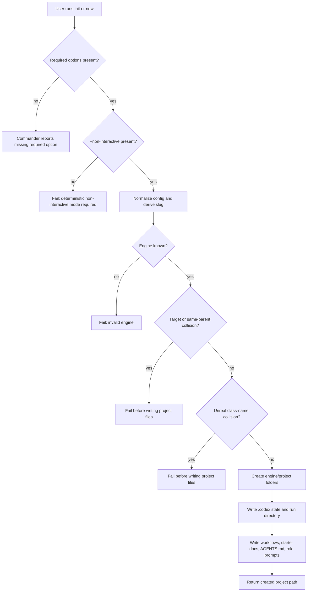

# Project Initialization Flow Guide

## Purpose

This architecture flow guide documents the runtime scenario for `opengamestudio init` and `opengamestudio new`. Both commands use the same initialization path to create a deterministic Codex Game Studio project under `projects/<slug>/`.

## Scope

This flow starts when a user invokes `init` or `new` with required project options. It ends when the generated project has engine markers, `.codex` state, workflow prompts, starter docs, role prompts, and project-level `AGENTS.md`.

This flow does **not** execute Codex and does **not** own task lifecycle persistence after project creation.

## Boundaries

Project initialization owns generated project creation and initial `.codex` state. Codex run execution, task lifecycle persistence, and verification/review behavior are owned by separate runtime flows and truth docs.

## Entry Points

| Entry point | Role in flow | Code |
| --- | --- | --- |
| `opengamestudio init` | Primary project initialization command. | `src/cli.ts` |
| `opengamestudio new` | Alias that delegates to the same initialization path. | `src/cli.ts` |
| `initProject(...)` | Creates project config, directories, state, docs, workflows, and prompts. | `src/projects.ts` |

## Preconditions

- The user supplies `--name`, `--engine`, `--mode`, and `--non-interactive`.
- The selected engine is known by the engine registry.
- The target `projects/<slug>/` path does not already exist.
- Same-parent project slug and Unreal class-name collision checks pass.

## Inputs

| Input | Source | Required | Notes |
| --- | --- | ---: | --- |
| Project name | `--name` | yes | Used for config and slug derivation. |
| Engine | `--engine` | yes | Must resolve to a supported engine registry entry. |
| Mode | `--mode` | yes | Selects active project/studio mode. |
| Non-interactive flag | `--non-interactive` | yes | Enforces deterministic scaffolding. |
| Concept/genre/platform/audience/etc. | Optional CLI flags | no | Written into starter planning artifacts where applicable. |
| Engine version override | `--engine-version` | no | Overrides default engine context. |

## Happy Path Sequence



## Branch Map



## Decision Table

| Condition | Branch | Behavior | User-visible result | Owning code/truth |
| --- | --- | --- | --- | --- |
| Required option missing | CLI parse failure | Stop before initialization. | Commander error. | `src/cli.ts`; `docs/truthmark/truth/contracts/cli-and-validation.md` |
| `--non-interactive` missing | Determinism guard | Stop before writing. | Required option error. | `src/cli.ts`; `docs/truthmark/truth/projects/project-scaffolding.md` |
| Engine is unknown | Engine registry guard | Stop before writing. | Invalid engine/lookup failure. | `src/engines.ts`; `docs/truthmark/truth/projects/project-scaffolding.md` |
| Target path exists | Collision guard | Stop before mutating target. | Existing project/path error. | `src/projects.ts`; `docs/truthmark/truth/projects/project-scaffolding.md` |
| Collision checks pass | Happy path | Write generated project surfaces. | `Created <name> at <path>`. | `src/projects.ts`; `docs/truthmark/truth/projects/project-scaffolding.md` |

## Generated Outputs

The successful flow creates or writes:

- `projects/<slug>/`
- `.codex/studio.json`
- `.codex/runs/`
- `.codex/workflows/*.md`
- starter design/production/market documents
- engine-specific marker files and source folders
- project-level `AGENTS.md`
- role prompt files for the canonical studio role roster

Forbidden generated project surfaces remain forbidden: `CODEX.md`, `project_orchestrator.md`, and `.gamestudio/runs`.

## Failure Modes And Debugging Cues

| Failure | Likely cause | Inspect |
| --- | --- | --- |
| Required-option failure | CLI command missing required flags. | `src/cli.ts` command definitions. |
| Invalid engine | Engine value not recognized or engine registry changed. | `src/engines.ts`, `engine_configs/**`. |
| Target collision | `projects/<slug>/` already exists. | Project directory and slug derivation in `src/projects.ts`. |
| Generated file missing in validation | Scaffolding contract drift. | `src/projects.ts`, `src/agents.ts`, `src/validation.ts`. |

## Code Traceability

| Behavior | Code |
| --- | --- |
| Command wiring and required options | `src/cli.ts` |
| Project creation and collision checks | `src/projects.ts` |
| Config normalization | `src/config.ts` |
| Engine-specific scaffold | `src/engines.ts`, `engine_configs/**` |
| Generated project instruction surface | `src/agents.ts` |
| Path/slug helpers | `src/paths.ts` |
| Project validation checks | `src/validation.ts` |

## Product Decisions

- Project creation remains deterministic and non-interactive for reproducible Codex project setup.
- Generated project instructions use Codex-native `AGENTS.md`; this flow does not introduce `CODEX.md` as a primary project instruction contract.

## Rationale

A bounded initialization flow gives users and agents a stable project scaffold without implying that scaffolding also executes Codex, manages planner state, or owns later runtime task transitions.

## Truth Sources

- `docs/truthmark/truth/projects/project-scaffolding.md`
- `docs/truthmark/truth/repository/overview.md`
- `docs/truthmark/truth/contracts/cli-and-validation.md`
- `docs/truthmark/routes/areas/repository.md`

## Verification

For behavior changes in this flow, run the relevant project workflow, agent/template, engine-system, and validation tests. For repository-wide readiness claims, run:

```bash
npm run validate
npx truthmark check --json
```
