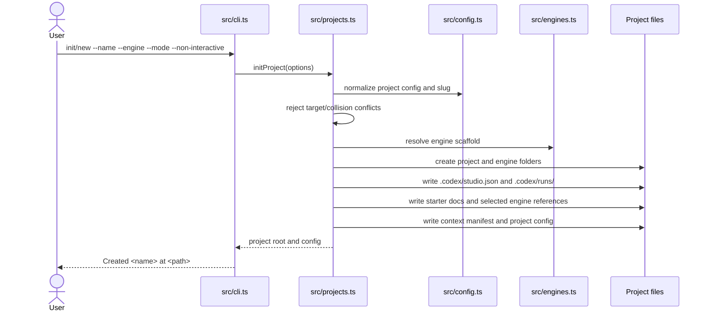
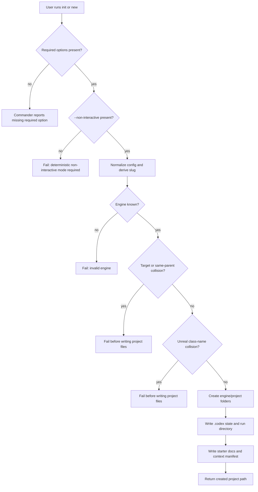

# Project Initialization Flow Guide

## Purpose

This architecture flow guide documents `codex-game-studio init` and `codex-game-studio new`.

Both commands use the same initialization path to configure project-specific state in the current repository root.

## Scope

This flow starts when a user invokes `init` or `new` with required project options.

It ends when the repository root has engine markers, `.codex` project state, starter docs, and selected engine references.

It does not create, copy, or overwrite tracked template instruction files.

It does not execute Codex and does not own task lifecycle persistence after project creation.

## Boundaries

Project initialization owns project-state creation and initial `.codex` state.

Tracked template surfaces are clone-time repository files, not init outputs.

Codex run execution, task lifecycle persistence, and verification/review behavior are owned by separate runtime flows and truth docs.

## Entry Points

| Entry point | Role in flow | Code |
| --- | --- | --- |
| `codex-game-studio init` | Primary project initialization command. | `src/cli.ts` |
| `codex-game-studio new` | Alias that delegates to the same initialization path. | `src/cli.ts` |
| `initProject(...)` | Creates project config, directories, state, docs, and engine references. | `src/projects.ts` |

## Preconditions

- The user supplies `--name`, `--engine`, `--mode`, and `--non-interactive`.
- The selected engine is known by the engine registry.
- The target root either has no `.codex/studio.json` or is force-refreshed for the same project intent.
- Same-parent project slug and Unreal class-name collision checks pass.
- Game-facing template files are expected to exist because the user cloned the template repository.

## Inputs

| Input | Source | Required | Notes |
| --- | --- | ---: | --- |
| Project name | `--name` | yes | Used for config and slug derivation. |
| Engine | `--engine` | yes | Must resolve to a supported engine registry entry. |
| Mode | `--mode` | yes | Selects active project/studio mode. |
| Non-interactive flag | `--non-interactive` | yes | Enforces deterministic scaffolding. |
| Concept/genre/platform/audience/etc. | Optional CLI flags | no | Written into starter planning artifacts where applicable. |
| Engine version override | `--engine-version` | no | Overrides default engine context. |

## Happy Path Sequence



## Branch Map



## Decision Table

| Condition | Branch | Behavior | User-visible result | Owning code/truth |
| --- | --- | --- | --- | --- |
| Required option missing | CLI parse failure | Stop before initialization. | Commander error. | `src/cli.ts`; `docs/truthmark/engineering/contracts/cli-and-validation.md` |
| `--non-interactive` missing | Determinism guard | Stop before writing. | Required option error. | `src/cli.ts`; `docs/truthmark/engineering/projects/project-scaffolding.md` |
| Engine is unknown | Engine registry guard | Stop before writing. | Invalid engine/lookup failure. | `src/engines.ts`; `docs/truthmark/engineering/projects/project-scaffolding.md` |
| Target path exists | Collision guard | Stop before mutating target. | Existing project/path error. | `src/projects.ts`; `docs/truthmark/engineering/projects/project-scaffolding.md` |
| Collision checks pass | Happy path | Write project state and starter assets. | `Created <name> at <path>`. | `src/projects.ts`; `docs/truthmark/engineering/projects/project-scaffolding.md` |

## Init Outputs

The successful flow creates or writes:

- `.codex/studio.json`
- `.codex/runs/`
- `.codex/approvals.json`
- `.codex/studio/config.json`
- `.codex/context-manifest.json`
- `.codex/context-manifest.meta.json`
- starter design/production/market documents
- selected engine reference files
- engine-specific marker files and source folders

The successful flow does not write:

- `AGENTS.md`
- `.codex/agents/*.toml`
- `.codex/workflows/*.md`
- `.agents/skills/*/SKILL.md`
- `.codex/prompts/**`

Forbidden generated project surfaces remain forbidden: `CODEX.md`, `project_orchestrator.md`, and `.gamestudio/runs`.

## Failure Modes And Debugging Cues

| Failure | Likely cause | Inspect |
| --- | --- | --- |
| Required-option failure | CLI command missing required flags. | `src/cli.ts` command definitions. |
| Invalid engine | Engine value not recognized or engine registry changed. | `src/engines.ts`, `engine_configs/**`. |
| Target collision | Root `.codex/studio.json` belongs to a different project. | Project state loading in `src/projects.ts`. |
| Project state missing in validation | Scaffolding contract drift. | `src/projects.ts`, `src/validation.ts`. |
| Template surface missing in validation | Clone/template surface drift. | `AGENTS.md`, `.codex/agents/**`, `.codex/workflows/**`, `.agents/skills/**`, `src/validation.ts`. |

## Code Traceability

| Behavior | Code |
| --- | --- |
| Command wiring and required options | `src/cli.ts` |
| Project creation and collision checks | `src/projects.ts` |
| Config normalization | `src/config.ts` |
| Engine-specific scaffold | `src/engines.ts`, `engine_configs/**` |
| Runtime role metadata | `src/agents.ts`, `src/roles.ts` |
| Path/slug helpers | `src/paths.ts` |
| Project validation checks | `src/validation.ts` |

## Product Decisions

- Project creation remains deterministic and non-interactive for reproducible Codex project setup.
- Template instructions use tracked Codex-native `AGENTS.md`, `.codex/agents`, `.codex/workflows`, and `.agents/skills` files.
- This flow does not introduce `CODEX.md` as a primary project instruction contract.
- This flow does not generate `.codex/prompts/**` mirrors.

## Rationale

A bounded initialization flow gives users and agents stable project state without implying that scaffolding also executes Codex, manages planner state, owns later runtime task transitions, or regenerates template instructions.

## Truth Sources

- `docs/truthmark/engineering/projects/project-scaffolding.md`
- `docs/truthmark/engineering/repository/overview.md`
- `docs/truthmark/engineering/contracts/cli-and-validation.md`
- `docs/truthmark/routes/areas/repository.md`

## Verification

For behavior changes in this flow, run the relevant project workflow, engine-system, template-surface, and validation tests.

For repository-wide readiness claims, run:

```bash
npm run validate
truthmark check --json
```
