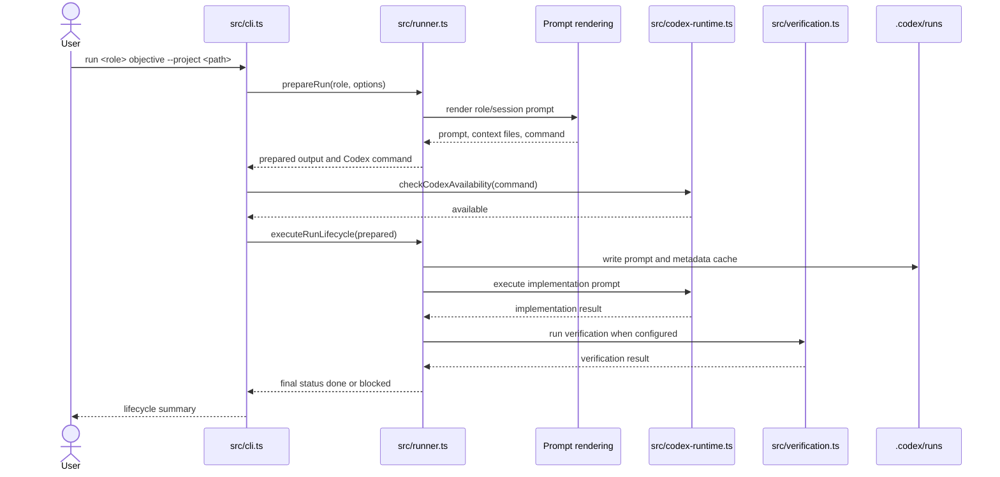
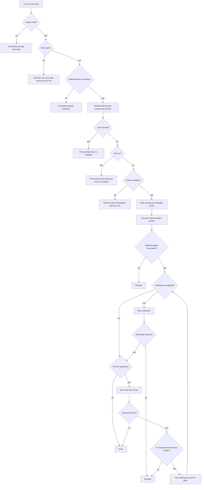

# Role Run Lifecycle Flow Guide

## Purpose

This architecture flow guide documents the runtime scenario for `opengamestudio run <role>`. The flow prepares a deterministic Codex prompt, optionally returns inspection output, and otherwise executes a bounded implementation/verification/review/fix lifecycle.

## Scope

This flow starts when a user invokes `run <role> ... --project <path>`. It ends when the CLI reports `done` or `blocked`, or when an inspection-only branch returns prompt/dry-run output without side effects.

This flow consumes role/workflow prompt contracts but does not own the content of each role package.

## Boundaries

The role run lifecycle owns runtime preparation, prompt inspection branches, Codex availability checks, implementation execution, optional verification, review, and bounded fix passes. Role definitions, generated workflow prompt contents, and project scaffolding are owned by adjacent truth docs and flows.

## Entry Points

| Entry point | Role in flow | Code |
| --- | --- | --- |
| `opengamestudio run <role>` | Public CLI command for role execution. | `src/cli.ts` |
| `prepareRun(...)` | Resolves project, validates role/task input, renders prompt, builds cache paths and Codex command. | `src/runner.ts` |
| `checkCodexAvailability(...)` | Confirms Codex can be executed before non-dry runs. | `src/codex-runtime.ts` |
| `executeRunLifecycle(...)` | Runs implementation, verification, review, and bounded fix passes. | `src/runner.ts` |

## Preconditions

- `--project <path>` points to a valid generated project with `.codex/studio.json`.
- The requested role is a canonical studio role ID.
- The task/objective is non-empty, either from positional objective text or `--task`.
- Codex availability is required only for non-dry, non-print execution.

## Inputs

| Input | Source | Required | Notes |
| --- | --- | ---: | --- |
| Role ID | positional `<role>` | yes | Must be a canonical hyphenated studio role ID. |
| Objective/task | positional objective or `--task` | yes | Drives prompt body. |
| Project path | `--project` | yes | Resolves `.codex/studio.json`. |
| Included artifacts | `--include-artifact` | no | Adds explicit project artifacts to context. |
| Broad context flag | `--allow-broad-context` | no | Allows broader context discovery. |
| Verification command | `--verify-command`, `--verify-arg` | no | Runs after implementation when configured. |
| Review flag | `--review` | no | Adds read-only review pass. |
| Fix flag/count | `--fix`, `--max-fix-passes` | no | Enables bounded fix passes when blocked. |
| Inspection flags | `--print-prompt`, `--dry-run` | no | Non-mutating inspection branches. |

## Happy Path Sequence



## Branch Map



## Decision Table

| Condition | Branch | Behavior | User-visible result | Side effects |
| --- | --- | --- | --- | --- |
| Invalid project | Project resolution failure | Stop before execution. | Error from project/task resolution. | No run cache. |
| Unknown role | Role validation failure | Stop before execution. | Message points to canonical role IDs. | No run cache. |
| `--print-prompt` | Prompt inspection | Render and print prompt body. | Prompt text. | No prompt cache, metadata, task state, or run directory writes. |
| `--dry-run` | Command/context inspection | Print selected context and Codex command. | Dry-run summary. | No prompt cache, metadata, task state, or run directory writes. |
| Codex unavailable | Runtime guard | Stop before lifecycle execution. | Availability/authentication error. | No lifecycle execution. |
| Verification fails | Verification blocker | Mark lifecycle blocked unless fix passes clear it. | Final status `blocked`. | Non-dry cache already written. |
| Review blockers found | Review blocker | Run bounded fix passes only when requested and available. | `blocked` or subsequent `done`. | Review uses read-only sandbox; fix uses workspace-write sandbox. |
| All required passes clear | Happy path | Report completion. | Final status `done`. | Non-dry run cache exists. |

## State And Mutation Rules

- `--print-prompt` and `--dry-run` are inspection-only and do not write prompt cache, metadata, task state, or run directories.
- Non-dry runs write prompt and metadata before executing Codex.
- Implementation and fix passes use a workspace-write Codex sandbox.
- Review passes use a read-only Codex sandbox.
- Final lifecycle status is `done` or `blocked`.

## Failure Modes And Debugging Cues

| Failure | Likely cause | Inspect |
| --- | --- | --- |
| Unknown role | Role ID typo or role registry drift. | `src/roles.ts`, `docs/truthmark/engineering/codex/roles-and-workflows.md`. |
| Empty objective | User omitted objective and `--task`. | `src/cli.ts`, `src/runner.ts`. |
| Codex unavailable | CLI missing, unauthenticated, or command path invalid. | `src/codex-runtime.ts`. |
| Verification timeout/failure | Verification command failed or exceeded timeout. | `src/verification.ts`, command output. |
| Malformed review JSON | Review pass did not produce expected schema. | `src/runner.ts`, review prompt contract. |
| Repeated blocked status | Implementation, verification, or review blockers not cleared by bounded fix passes. | Run lifecycle output and `.codex/runs/` metadata. |

## Code Traceability

| Behavior | Code |
| --- | --- |
| CLI option parsing and inspection branch exit | `src/cli.ts` |
| Run preparation, prompt/cache metadata, lifecycle orchestration | `src/runner.ts` |
| Role IDs and unknown-role message | `src/roles.ts` |
| Prompt/session rendering inputs | `src/codex-session.ts`, `src/codex-prompts.ts` |
| Codex availability and command execution | `src/codex-runtime.ts` |
| Verification command execution and timeout behavior | `src/verification.ts` |
| File-backed task mutation when running tasks | `src/tasks.ts` |

## Product Decisions

- `--print-prompt` and `--dry-run` stay inspection-only and do not mutate run state.
- Non-dry role runs explicitly execute Codex and report a final `done` or `blocked` status.
- Review is read-only; fix passes are bounded and workspace-write.

## Rationale

Separating inspection, implementation, verification, review, and fix branches makes the Codex lifecycle auditable without inventing hidden planner, telemetry, ownership enforcement, or parallel orchestration behavior.

## Truth Sources

- `docs/truthmark/engineering/codex/runtime-and-tasks.md`
- `docs/truthmark/engineering/codex/roles-and-workflows.md`
- `docs/truthmark/engineering/contracts/cli-and-validation.md`
- `docs/truthmark/routes/areas/repository.md`

## Verification

For behavior changes in this flow, run runner, task, verification, Codex runtime, role, and prompt/session tests as relevant. For repository-wide readiness claims, run:

```bash
npm run validate
npx truthmark check --json
```
