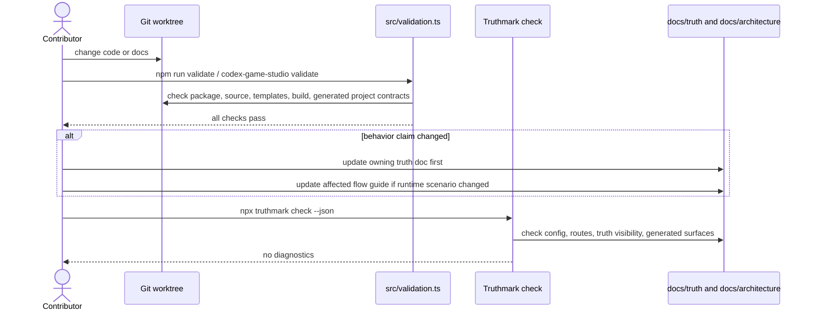
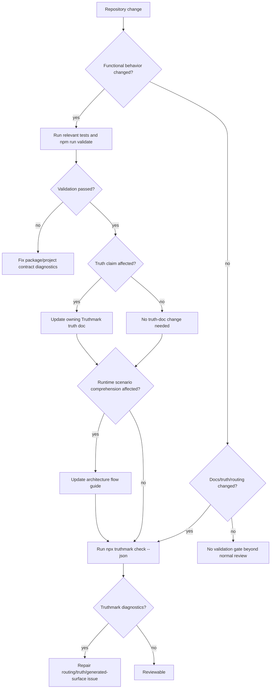

# Validation And Repository Truth Flow Guide

## Purpose

This architecture flow guide documents the validation path around Codex Game Studio behavior changes and the injected Truthmark repository-truth workflow around documentation/routing updates.

Validation is an Codex Game Studio CLI/package behavior. Truthmark is an injected repository-truth workflow/tooling layer for documentation authority, routing, and agent workflow surfaces; it is not an Codex Game Studio runtime feature unless product code explicitly implements Truthmark-facing behavior.

## Scope

This guide covers two related but separate flows:

1. `codex-game-studio validate` / `npm run validate` checks package and generated-project contracts.
2. `npx truthmark check --json` checks repository-truth routing and generated Truthmark surfaces.

The guide ends when validation/truth checks have either passed or produced diagnostics that identify the broken contract.

## Boundaries

Repository validation is an Codex Game Studio package behavior implemented by the CLI and validation modules. Truthmark checks are an injected repository-truth workflow/tooling layer for documentation authority and generated agent surfaces, not an Codex Game Studio runtime feature.

## Entry Points

| Entry point | Role in flow | Code / owner |
| --- | --- | --- |
| `codex-game-studio validate` | Public CLI validation command. | `src/cli.ts`, `src/validation.ts` |
| `npm run validate` | Repository readiness gate that builds/tests/validates through package scripts. | `package.json` |
| `npx truthmark check --json` | Injected repository-truth consistency check. | Truthmark tooling, `.truthmark/config.yml` |
| Truthmark route files | Map code surfaces to bounded truth docs. | `docs/truthmark/routes/areas.md`, `docs/truthmark/routes/areas/repository.md` |
| Truth docs | Canonical bounded behavior/reference docs. | `docs/truthmark/engineering/**` |

## Preconditions

- Repository validation expects package metadata, source files, templates, engine configs, and build output to match the package contract.
- Project validation expects a generated project with valid `.codex/studio.json` when `--project <path>` is supplied.
- Truthmark checks expect `.truthmark/config.yml` and configured route/truth docs to remain internally consistent when present.

## Inputs

| Input | Source | Required | Notes |
| --- | --- | ---: | --- |
| Repository files | Worktree | yes | Package metadata, source, templates, engine configs, generated surfaces. |
| Project path | `--project` | no | Adds generated-project validation checks. |
| Truthmark config | `.truthmark/config.yml` | for Truthmark checks | Configures doc roots, routes, and generated surfaces. |
| Route docs | `docs/truthmark/routes/areas*.md` | for Truthmark checks | Map code/doc surfaces to bounded truth docs. |
| Truth docs | `docs/truthmark/engineering/**` | for Truthmark checks | Canonical behavior/reference claims. |

## Happy Path Sequence



## Branch Map



## Decision Table

| Condition | Branch | Required action | Output/diagnostic | Owner |
| --- | --- | --- | --- | --- |
| Source/package behavior changed | Functional validation branch | Run relevant tests and `npm run validate`. | Failing package/project check if contract is broken. | Codex Game Studio repo |
| Template/project behavior changed | Project validation branch | Validate template and project-state contracts. | Missing/invalid template or project-state diagnostic. | `src/validation.ts` and scaffold owners |
| Public CLI claim changed | CLI contract branch | Update contract truth doc and validation/readme claims together. | Validation or doc drift if missed. | `docs/truthmark/engineering/contracts/cli-and-validation.md` |
| Behavior claim changed | Truth sync branch | Update owning bounded truth doc. | Truthmark may flag stale/unmapped surfaces. | Truthmark docs workflow |
| Flow comprehension changed | Runtime-view branch | Update affected architecture flow guide after truth doc. | Stale walkthrough if missed. | `docs/architecture/flows/**` |
| Truthmark generated surface changed | Injected workflow branch | Preserve managed blocks and run Truthmark check/init only when appropriate. | Generated surface diagnostic. | Truthmark tooling layer |

## Failure Modes And Debugging Cues

| Failure | Likely cause | Inspect |
| --- | --- | --- |
| Validation check fails | Package metadata, source, templates, build output, or project scaffold drift. | `src/validation.ts`, failing check ID. |
| Future-surface guard fails | CLI/docs exposed unimplemented planner/telemetry/parallel/ownership surface. | `src/cli.ts`, README/docs, validation tests. |
| Truthmark reports route/topology issue | Code or docs moved outside bounded route ownership. | `docs/truthmark/routes/areas.md`, `docs/truthmark/routes/areas/repository.md`. |
| Truth doc and flow guide diverge | Flow guide was updated without updating canonical truth or vice versa. | Owning `docs/truthmark/engineering/**` file and affected `docs/architecture/flows/**` file. |
| Portal output stale | Generated non-canonical site not refreshed after Markdown changes. | `docs/truthmark/generated/portal/` and portal provenance. |

## Code And Document Traceability

| Behavior / concern | Owner |
| --- | --- |
| CLI validation command wiring | `src/cli.ts` |
| Validation checks and project contract diagnostics | `src/validation.ts` |
| Package scripts/bin/files contract | `package.json`, `docs/truthmark/engineering/contracts/cli-and-validation.md` |
| Truthmark config and generated workflow surfaces | `.truthmark/config.yml`, generated agent files |
| Truth routing | `docs/truthmark/routes/areas.md`, `docs/truthmark/routes/areas/repository.md` |
| Bounded canonical behavior docs | `docs/truthmark/engineering/**` |
| Cross-cutting runtime scenario explanations | `docs/architecture/flows/**` |
| Generated presentation output | `docs/truthmark/generated/portal/` |

## Product Decisions

- `npm run validate` remains the readiness gate before repository parity claims.
- Truthmark checks validate repository-truth routing and generated workflow surfaces without redefining Codex Game Studio runtime behavior.
- Markdown truth docs remain canonical; generated portal HTML remains non-canonical presentation.

## Rationale

Keeping validation and repository-truth checks adjacent but distinct prevents injected Truthmark workflow scaffolding from being mistaken for product functionality while still making documentation authority auditable.

## Truth Sources

- `docs/truthmark/engineering/contracts/cli-and-validation.md`
- `docs/truthmark/engineering/repository/overview.md`
- `docs/truthmark/routes/areas/repository.md`
- `.truthmark/config.yml`

## Verification

For behavior changes, run relevant tests and:

```bash
npm run validate
```

For repository-truth docs/routing/generated-surface changes, run:

```bash
npx truthmark check --json
```

When both behavior and truth docs change, run both gates.
