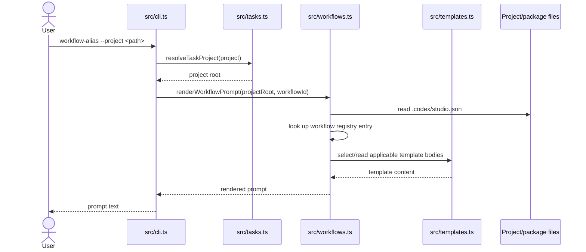
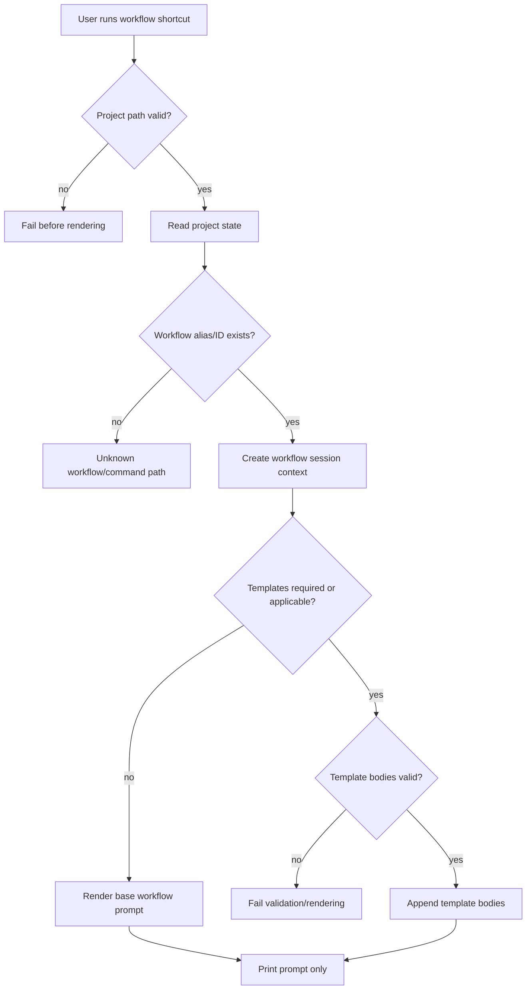

# Workflow Prompt Rendering Flow Guide

## Purpose

This architecture flow guide documents render-only workflow shortcut commands such as `market`, `analytics`, `design-spec`, `feel-review`, `art-direction`, `ui-review`, `milestone`, `handoff`, `review`, and `ship-check`.

These commands produce deterministic Codex prompts for workflow scenarios without launching Codex or implying hidden orchestration.

## Scope

This flow starts when a user invokes a workflow shortcut with `--project <path>`. It ends when the CLI prints the rendered workflow prompt.

This flow does **not** execute Codex, does **not** write run cache metadata, and does **not** create a planner/next queue.

## Boundaries

Workflow prompt rendering owns deterministic prompt text for workflow shortcut commands. It does not own Codex runtime execution, task status mutation, generated project scaffolding, or future-only planner/telemetry/orchestration surfaces.

## Entry Points

| Entry point | Role in flow | Code |
| --- | --- | --- |
| Workflow CLI aliases | Public render-only commands for selected workflow IDs. | `src/cli.ts`, `src/workflows.ts` |
| `review` and `ship-check` commands | Render prompts for explicit workflow IDs without requiring a role run. | `src/cli.ts` |
| `renderWorkflowPrompt(...)` | Resolves project state and renders workflow prompt content. | `src/workflows.ts` |
| Template registry | Supplies optional template bodies when a workflow needs them. | `src/templates.ts`, `templates/**` |

## Preconditions

- `--project <path>` resolves to a valid generated project.
- `.codex/studio.json` contains engine/project context required by the workflow prompt.
- The requested workflow ID or alias exists in the workflow registry.
- Any required template body is present and valid.

## Inputs

| Input | Source | Required | Notes |
| --- | --- | ---: | --- |
| Workflow alias/ID | CLI command | yes | Maps to a workflow registry entry. |
| Project path | `--project` | yes | Provides project and engine context. |
| Dry-run flag | `--dry-run` | no | Accepted as render-only wording; command already does not launch Codex. |
| Template bodies | package assets | no/conditional | Appended when selected by workflow/template rules. |

## Happy Path Sequence



## Branch Map



## Decision Table

| Condition | Branch | Behavior | User-visible result | Side effects |
| --- | --- | --- | --- | --- |
| Project invalid | Project resolution failure | Stop before rendering. | Error from project resolution. | None. |
| Workflow command exists | Happy path | Render workflow prompt for configured workflow ID. | Prompt text. | None. |
| Applicable template exists | Template append branch | Add template content to prompt. | Prompt text includes template body. | None. |
| Template invalid/missing | Template validation/render failure | Stop or fail validation depending on call path. | Error or validation failure. | None. |
| User expects execution | Non-goal branch | Command still only renders prompt. | Prompt text only. | Codex is not launched. |

## Render-Only Rules

- Workflow shortcut commands render prompts and return text.
- They do not call Codex.
- They do not write `.codex/runs/` cache files.
- They do not mutate `.codex/studio.json` or `.codex/tasks.json`.
- They do not expose hidden planner, telemetry, ownership enforcement, or parallel orchestration behavior.

## Failure Modes And Debugging Cues

| Failure | Likely cause | Inspect |
| --- | --- | --- |
| Project resolution failure | Missing or invalid `.codex/studio.json`. | `src/tasks.ts`, generated project state. |
| Alias drift | CLI alias and workflow registry diverged. | `src/cli.ts`, `src/workflows.ts`. |
| Missing template content | Package asset drift or template registry error. | `src/templates.ts`, `templates/**`, package files. |
| Prompt claim overstates automation | Documentation or prompt text implies unimplemented planner/execution behavior. | `src/workflows.ts`, `docs/truthmark/truth/codex/roles-and-workflows.md`. |

## Code Traceability

| Behavior | Code |
| --- | --- |
| Workflow command registration | `src/cli.ts` |
| Workflow registry and prompt rendering | `src/workflows.ts` |
| Project path validation used by workflow commands | `src/tasks.ts` |
| Template lookup, rendering, and required-section validation | `src/templates.ts`, `templates/**` |
| Validation of workflow/prompt contracts | `src/validation.ts` |

## Product Decisions

- Workflow shortcut commands remain render-only prompt surfaces.
- Prompt rendering may include templates, but it must not imply unimplemented planner, execution, telemetry, or ownership-enforcement behavior.

## Rationale

Keeping workflow commands render-only lets users inspect and hand off workflow prompts while avoiding hidden side effects or undocumented automation.

## Truth Sources

- `docs/truthmark/truth/codex/roles-and-workflows.md`
- `docs/truthmark/truth/contracts/cli-and-validation.md`
- `docs/truthmark/truth/repository/overview.md`
- `docs/truthmark/routes/areas/repository.md`

## Verification

For behavior changes in this flow, run workflow, template, Codex prompt/session, and validation tests as relevant. For repository-wide readiness claims, run:

```bash
npm run validate
npx truthmark check --json
```
